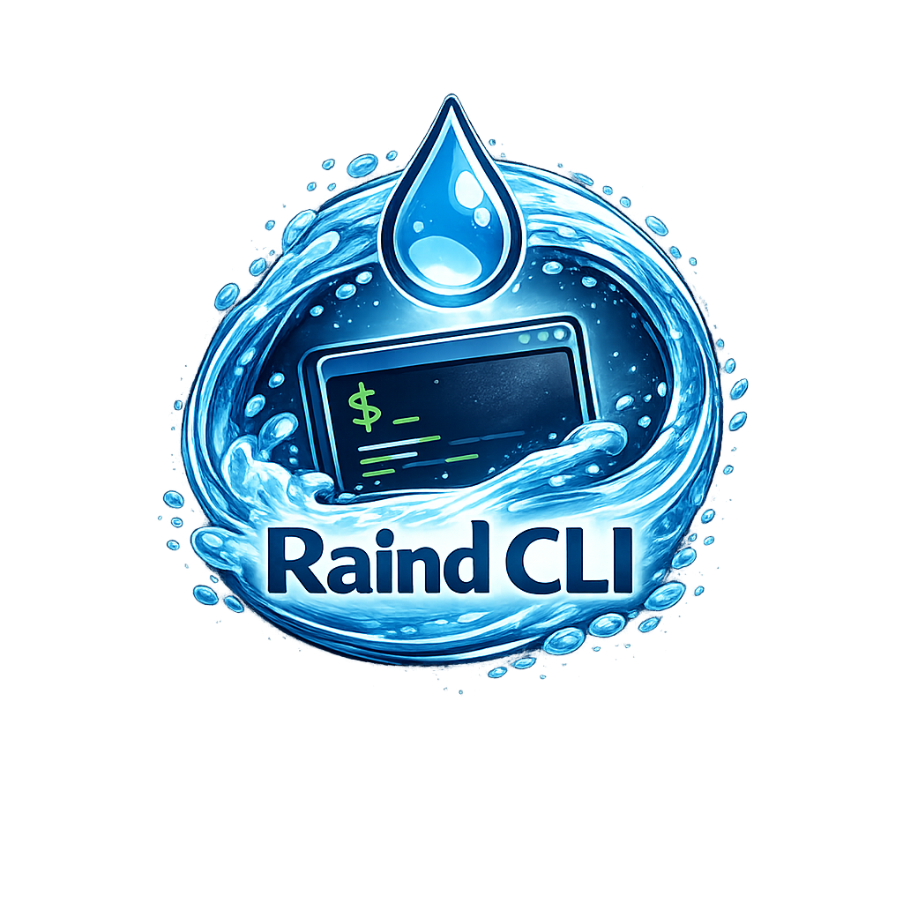

# Raind CLI
<p>
  
</p>
Raind CLI is the user-facing command-line interface of the Raind container runtime stack.
It provides a unified interface for creating, managing, and interacting with containers by communicating with the high-level container runtime via REST and WebSocket APIs.

Raind CLI itself does not directly manipulate namespaces, cgroups, or filesystems.
Instead, it translates user intent into API requests and delegates execution to the underlying runtime layers.

## Runtime Stack Architecture
The Raind container runtime stack is composed of three layers:

- **Raind CLI** – A command-line interface that accepts user input and controls the runtime stack
(this repository)

- **Condenser** – A high-level container runtime responsible for container lifecycle management, image handling, and state management  
(repository: https://github.com/pyxgun/Condenser)

- **Droplet** – A low-level container runtime that performs container setup and execution in an OCI-compliant manner  
(repository: https://github.com/pyxgun/Droplet)

Raind CLI communicates exclusively with Condenser using HTTP-based REST APIs.
For interactive containers, it establishes WebSocket connections to provide terminal I/O over pseudo-terminals.

## Features
Raind CLI currently supports:

- Container lifecycle operations (create, start, stop, delete)
- Listing containers and inspecting container state
- Executing commands inside running containers
- Attaching to containers with pseudo-terminals
- Interactive terminal sessions via WebSocket
- REST-based communication with the high-level runtime
- Clear separation between user interface and runtime implementation

## Build
### Requirements
- Linux
- Go (version 1.25 or later)
- A running Condenser service
```bash
git clone git@github.com:pyxgun/Raind-CLI.git
cd raind-cli
go build -o raind ./cmd/raind
```

## Usage
Raind CLI is intended to be used as the primary interface for operating the Raind container runtime stack.
It requires a running Condenser instance, which manages the underlying runtime environment.

### Pre-required Setup
Before using Raind CLI, ensure that:
- Condenser is running and accessible via its REST API endpoint
- Droplet is installed and available to Condenser

Raind CLI does not perform environment setup by itself.

## Command Examples
### container
```bash
# create a container as background process
raind container create <image:tag> [cmd(,arg1,arg2,...)]
# create a container with attaching tty
raind container create -t <image:tag> [cmd(,arg1,arg2,...)]

# start a container
raind container start <contianer-id>

# attach container
raind container attach <container-id>

# run a container (create+start[+attach,if -t specified])
raind container run [-t] [--rm] <image:tag>

# stop a container
raind container stop <container-id>

# remove a container
raind container rm <container-id>

# list containers
raind container ls
```
### image
```bash
# pull an image
raind image pull <image:tag>

# remove an image
raind image rm <image:tag>

# list images
raind image ls
```

## Design Philosophy
Raind CLI follows these design principles:
- **Thin interface**: All container logic is handled by Condenser and Droplet
- **Protocol-driven**: Communication is performed via explicit APIs (REST/WebSocket)
- **Composability**: The CLI can be replaced or extended without modifying runtime internals
- **Transparency**: Container state and behavior are observable through clear commands

## Status
Raind CLI and the Raind container runtime stack are currently under active development.
Command syntax, APIs, and behavior may change without notice.